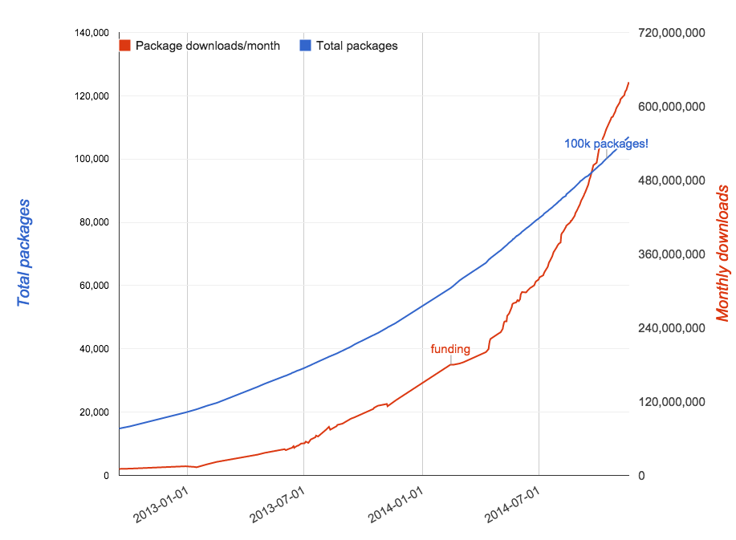
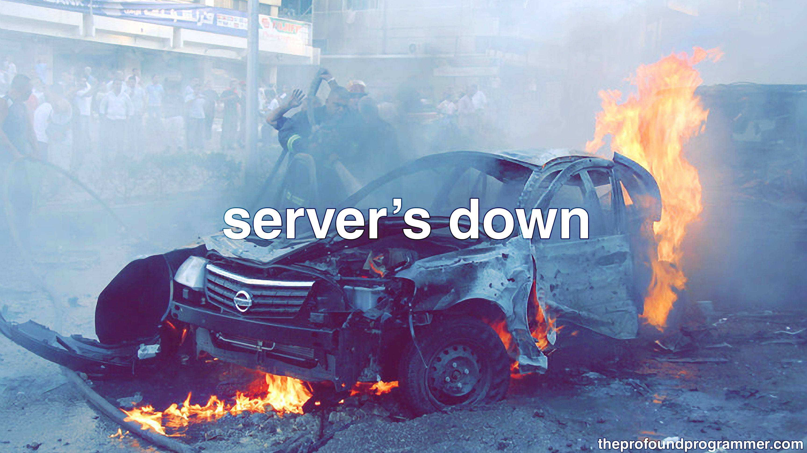
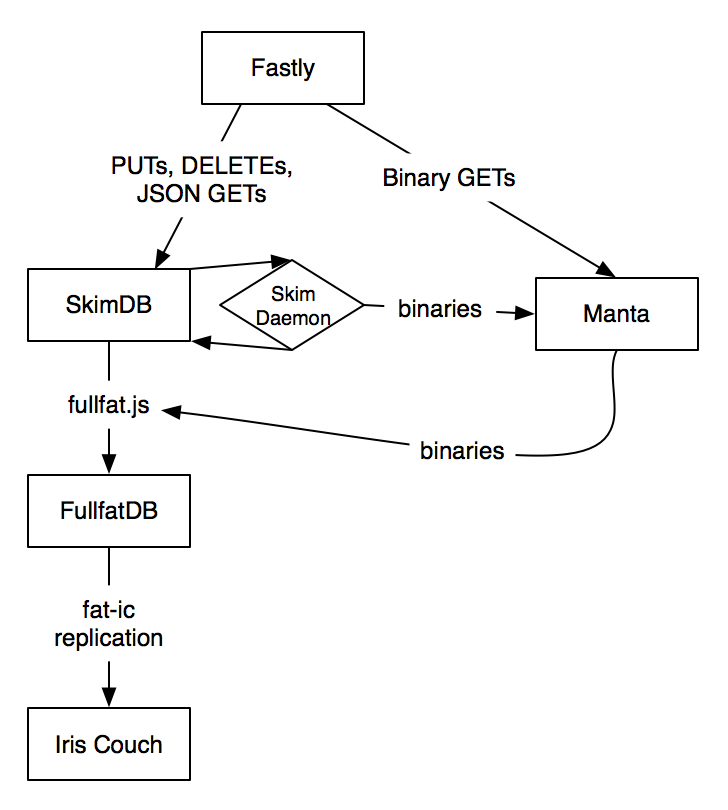
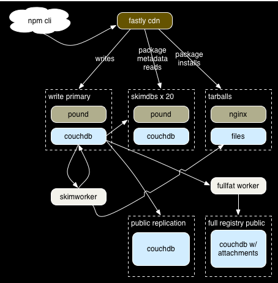
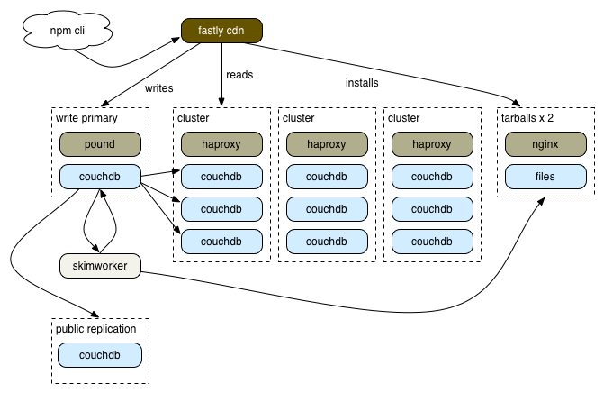

# [fit] scaling the
# [fit] registry

---

# [fit] C J Silverio
## [fit] devops at npmjs.com
## [fit] @ceejbot

---

# [fit] What we did
# [fit] lessons learned
# [fit] generalizations

^ Not just what we did, but larger lessons I learned from doing this. Share with you.

---

^ Why scaling the registry matters to me. Everything we talk about here today depends on npm working.

---

# [fit] Jacques Marneweck
# [fit] Benjamin Coe
# [fit] Laurie Voss

^ The team. I did none of this stuff alone. Jacques for SmartOS expertise. Ben is my comrade in dev ops arms. Laurie is our CTO.

---

^ What was the scaling challenge? Here's the chart of monthly downloads from 2013 on.

---

# [fit] January 2013
# [fit] 20K packages
# [fit] .5 million dls/day

---

# [fit] January 2014
# [fit] 60K packages
# [fit] 8 million dls/day

---

# [fit] Nov 2014
# [fit] > 100K packages
# [fit] 28 million dls/day peak

^ Today. How did we get there? Story of how we went from being on fire to being boring.

---

# [fit] side project
# [fit] 100% couchdb
# [fit] donated hosting
# [fit] IrisCouch 

^ starting point: couch app with 100% of the code in couchdb views; 8000 lines of javascript; hosted by IrisCouch for free. couch exposed directly.

---

# October 2013

^ Benign neglect caught up. This is when Nodejitsu ran the "scale npm" fundraiser. Your money went to keeping it hosted at all during this time.

---

# [fit] General lesson #1
# [fit] Put a cache on it

^ Nov 2013 put Fastly's CDN in front of it. Data not changing, like tarballs? Cache it. We now cache aggressively. Geolocal POPs make Aus & Euro mirrors less crucial. (Registry got more expensive to run.)

---

# [fit] Re-architecture 1
# [fit] move tarballs out
# [fit] of poor couchdb

^ The first time node is involved in the registry service! Tarballs are served from joyent's manta, which is an object store thing backed by postgres.

---

^ January 2014. This was more or less holding up under the load, though there were still outages with absolutely no visibility into why.

---

# [fit]  February 2014
# [fit] company founded

^ The problem was going to take money & dedicated engineering to solve.

---

# [fit] hosted on Joyent/SmartOS
# [fit] hand-built CouchDB + Spidermonkey
# [fit] bash scripts to deploy

^ Everything was hand-built. 10 special snowflake servers.

---

# [fit] Twitter tells us
# [fit] when we're down

^ This is when I arrive. PagerDuty account: first thing I did. Nagios all hooked up & monitoring basic host health. 10 hosts total.

---

# [fit] Re-architecture 2
# [fit] Many couchdbs

^ Separate writes from reads. Separate out replication.

---

# [fit] General lesson #2
# [fit] understand your db deeply

^ The stabilization phase happened because we finally understood it. We became aware that networking flickers caused couchdb replication to break, and so we could tune the retries AND write a fall-back heal script.

---

# [fit] Monitoring
# [fit] & alerts

^  is a host up/down is a boring question. you need to monitor your user's experience. is the service working from their POV? if not, what are the telltales?

---

# [fit] General lesson #3
# [fit] Add monitoring after
# [fit] every outage

^ What would have tipped you off that things were about to break?

---

## [fit] 1: reactive
## [fit] monitor deeply
## [fit] fix things quickly

^ Stabilization stage 1: react quickly. Notice when we're down & fix by hand.

---

## [fit] 2: proactive
## [fit] self-healing monitoring
## [fit] \(also things don't break)

^ Monitor checks also fix problems where possible. Deeper problems fixed with engineering. Unit tests for your deployment.

---

# [fit] June 2014
# [fit] Superficially
# [fit] similar.

^ Pretty reliable. We know when our providers are down before they do sometimes. Manta is gone-- tarballs are served from a file system behind nginx. Writes are separated from reads. Scaled by throwing hardware & $ at the problem.

---

# [fit] AWS / Ubuntu
# [fit] 70/30 west/east split
# [fit] 52 running instances, variable

^ Another big change: we moved to Ubuntu on AWS with significant wins in compatibility & tooling.

---

^ The registry today. WAY fewer instances & cheaper to run. Extra capacity for redundancy: if an AWS region goes down, we're fine.

---

# [fit] 50/50 AWS region split
# [fit] haproxy to load balance
# [fit] no AWS-specific magic

^ We use as few AWS features as possible to keep our options open.

---

# [fit] Fastly: geoloc + cache
# [fit] haproxy / CouchDB
# [fit] nginx + a filesystem

^ Simple pieces with good visibility.

---

# [fit] behind the scenes
# [fit] ansible / nagios
# [fit] InfluxDB+Grafana

^ Grown-up ops habits.

---

# [fit] General lesson #4
# [fit] metrics
# [fit] for everything

^ All of your services & instances should report metrics that can be visualized.

---

## [fit] memory & cpu use
## [fit] request latency
## [fit] event counts

^ Process restarts; bytes in & out of load balancers.

---

# [fit] metrics ==
# [fit] visibility

^ What is your system doing? What does it look like on a normal day? What are its trends? We saved $20K on our networking bandwidth bill by monitoring what our haproxies were doing & choking off a healthcheck gone mad.

---

# [fit] metrics drive
# [fit] monitoring

^ This is the goal for me; not there yet.

---

# [fit] General lesson #5
# [fit] automate

^ Chef, Puppet, Salt, Ansible: USE SOMETHING.

---

# [fit] no special snowflakes
# [fit] every instance can be replaced

^ All hosts are configurable remotely & can be replaced easily. Discipline. AWS reboot apocalypse was boring for us.

---

# [fit] General lesson #6
# [fit] the goal is to be
# [fit] BORING

^ Being on-call should be boring. Heroics should NEVER be required. Putting out fires is a bad thing: avoid the fires in the first place.

---

# [fit] if operations are
# [fit] boring
# [fit] you can do the dev

^ replicate into relational dbs, improve searchability, add features: private modules. All of this is work that's possible now that our daily operations are boring.

---

# [fit] Goal: to be the most boring
# [fit] part of your node experience

^ Reliable. Something you don't think about because we're always there.

----

# [fit] npm client <3
# [fit] `npm install -g npm@latest`

^ So many bug fixes & performance improvements.

---

# [fit] npm loves you

^ thanks.
