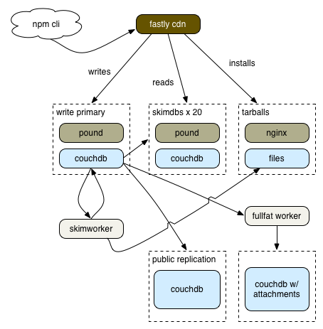

# [fit] scaling the
# [fit] registry

---

# [fit] C J Silverio
## [fit] devops at npmjs.com
## [fit] @ceejbot

---

Why scaling the registry matters to me.

---

# [fit] What we did
# [fit] lessons learned
# [fit] generalizations

---

# [fit] Jacques Marneweck
# [fit] Benjamine Coe
# [fit] Laurie Voss

^ The team. I did none of this stuff alone. Jacques for SmartOS expertise. Ben is my comrade in dev ops arms. Laurie is our CTO.

---

# [fit] side project
# [fit] 100% couchdb
# [fit] donated hosting
# [fit] IrisCouch 

^ starting point: couch app with 100% of the code in couchdb views; 8000 lines of javascript; hosted by IrisCouch for free

---

# October 2013

^ Benign neglect caught up. This is when Nodejitsu ran the "scale npm" fundraiser. Your money went to keeping it hosted at all during this time.

---

# [fit] Put a cache on it

^ Nov 2013 it stabilized because Fastly's CDN was put in front. We now cache aggressively. Geolocation makes it much faster for you all here in Europe-- mirrors aren't needed any more. Internet secret is that everything is fast because it's served from memory.

---

# [fit] Re-architecture 1
# [fit] move tarballs out

^ The first time node is involved in the registry service! Tarballs are served from joyent's manta, which is an object store thing backed by postgres.

---

#  February 2014

* company founded & funded
* 100% hosted on Joyent
* several couchdbs load-balanced by Fastly
* hand-built CouchDB + Spidermonkey
* automation by bash
* Twitter tells us when we're down

---

# [fit] let's put out
# [fit] the fires

^ This is when I arrive. PagerDuty account: first thing I did. Nagios all hooked up & monitoring basic host health. 10 hosts total.

---

# [fit] Monitoring
# [fit] & alerts

^  is a host up/down is a boring question. you need to monitor your user's experience. is the service working from their POV? if not, what are the telltales?

---

# [fit] Rearchitecture 2
# [fit] Many couchdbs

^ Separate writes from reads. Separate out replication.

---

# Stabilization stage 1
## reactive

* monitor everything more deeply
* methodically identify & monitor causes of outages
* react quickly to fix problems
* Twitter is no longer telling us when we're down

---

# Stabilization stage 2
## proactive

* our second devops person: Ben Coe
* recurring problems fixed in the apps
* monitoring checks self-heal
* redundancy everywhere

---

# [fit] June 2014
# [fit] Superficially
# [fit] similar.

^ Pretty reliable. We know when our providers are down before they do sometimes. Manta is gone-- tarballs are served from a file system behind nginx. We have a write primary & a second replication primary, and a bunch of leaves that just read from the replication primary.

---

# [fit] AWS / Ubuntu
# [fit] 70/30 west/east split
# [fit] 52 running instances, variable

^ DJ mode: The new infrastructure would run alongside the old one. I'd fade the old one out & the new one in & registry users wouldn't notice the transition.

---

^ The registry today.

---

# [fit] 50/50 AWS region split
# [fit] haproxy to load balance
# [fit] far fewer instances

---

# [fit] public stack
# [fit] Fastly CDN
# [fit] haproxy / CouchDB
# [fit] nginx + a filesystem

---

# [fit] behind the scenes
# [fit] ansible
# [fit] nagios
# [fit] InfluxDB + Grafana

---

# [fit] General lesson #1
# [fit] Understand your app

---

# [fit] General lesson #2
# [fit] metrics

^ Talk about what they are

---

---

## [fit] memory & cpu use
## [fit] request latency
## [fit] event counts

^ Process restarts

---

# [fit] metrics ==
# [fit] visibility

^ What is your system doing? What does it look like on a normal day? What are its trends? We saved $20K on our networking bandwidth bill by monitoring what our haproxies were doing & choking off a healthcheck gone mad.

---

# [fit] metrics drive
# [fit] monitoring

^ This is the goal for me; not there yet.

---

# [fit] General lesson #3
# [fit] automate

---

# [fit] no special snowflakes
# [fit] every instance can be replaced

^ Do this. All hosts are configurable remotely & can be replaced easily.

---

# [fit] Next steps

---

# [fit]
