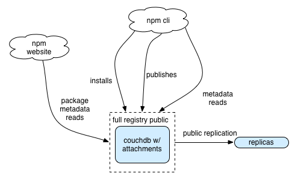

# [fit] stabilizing the
# [fit] registry

---

# [fit] C J Silverio
## [fit] director of engineering
## [fit] @ceejbot

---

# [fit] Roll back to the last
# [fit] Node Summit, Dec 2013

---

# October 2013

^ I was running a team writing node services & wondering how I could protect myself from npm outages. Thought I had to run a registry; that was too much trouble.

---

# [fit] Feb 2014:
# [fit] hired into a brand new company
# [fit] to put out the fire

^ Not just run a registry, but the registry. Ulp.

----

# [fit] scaling problem
# [fit] appearing as a
# [fit] stability problem

---

# [fit] "scaling"
# [fit] capacity to meet
# [fit] growing demands

^ Definitions. Whatever form those demands take

---

# [fit] "At scale"
# [fit] huge demand & lots of data

^ Google, Facebook, Apple, Twitter-- those are "at scale". Peeps in audience from Netflix & Paypal have a bigger scaling challenge. Npm: not at scale. But when hundreds of cos start using it, it acquires a scaling problem.

---

# [fit] "stability"
# [fit] not falling over
# [fit] under normal demand

^ For bonus points, not falling over under peak demand.

---

# [fit] 129,796 packages
# [fit] 239 GB package tarballs
# [fit] 40 million package dls/day
# [fit] 1500 req/sec, peak 3000

^ If I gave you those requirements as a greenfield project, you wouldn't have much trouble building a system that met them. The problem is that you never have a greenfield proj. You have legacy projects.

---

# [fit] "Legacy"
# [fit] Anything you've put into production

^ Legacy is inertia. It's mass that slows down change. Code in production can't be changed without understanding how the existing system works.

---

# [fit] this is the story of
# [fit] a legacy system
# [fit] becoming more flexible

^ Why am I telling you this story.

---

^ This is the starting architecture. The registry lives entirely inside a single CouchDB instance. Tarballs are base64-encoded attachments on package documents. The app logic is entirely implemented as javascript inside Couchdb. Ironically, there is 0 node in the registry.

---

# [fit] January 2013
# [fit] 20K packages
# [fit] .5 million dls/day

^ There is no load to speak of. Practically anything could handle this. (Act 1. Our protagonist goes through her normal day.)

---

# [fit] Oct 2013
# [fit] 44K packages
# [fit] 108 million dls/month
# [fit] 3.6 million dls/day

^ Then you all started adopting node, and what had worked for 2 years stopped working. Twice the number of packages, 7 times the usage. These numbers are not large, but it's a tipping point.

---

# [fit] and the saga begins

---

# [fit] cache
# [fit] rules everything
# [fit] around me

^ Put it behind a CDN. Data not changing? CACHE IT. (Changed the npm application so more of the data is immutable, e.g., you can't change a version once you've published it. We can cache even more!) CDN benefits.

---

# [fit] step 1: CDN
# [fit] Put Fastly.com
# [fit] in front of the registry

^ Obvious? Yes! This put out the worst of the fires. The problem is that it costs $ to do this, and side projects run on donated hosting don't have $.

---

# [fit] don't make your
# [fit] poor database
# [fit] do things it's bad at

^ Binary blobs don't belong in dbs that need to base64 encode them.

---

# [fit] step 2: tarballs
# [fit] get them out of couchdb

^ Out of couchdb & into Joyent's Manta, an object store backed by postgres with a nice API. They're now sitting on a filesystem served by nginx. 1 aws instance is more than capable of handling what load gets through from Fastly, but we have several for region redundancy. Node does the work of pulling tarballs out.

----

^ January 2014. This was more or less holding up under the load, though there were still outages with absolutely no visibility into why.

---

# [fit] January 2014
# [fit] 60K packages
# [fit] 6+ million dls/day

^ 3x the packages, 16x the dls. Act 2 begins.

---

# [fit]  February 2014
# [fit] company founded

^ It takes money to pay for the CDN & for dedicated engineering working on the rearchitecture.

---

# [fit] hosted on Joyent/SmartOS
# [fit] hand-built CouchDB + Spidermonkey
# [fit] bash scripts to deploy

^ Everything was hand-built. 10 special snowflake servers. This is when I arrive. PagerDuty account: first thing I did. Nagios all hooked up & monitoring basic host health. 10 hosts total.

---

# [fit] step 3: monitoring
# [fit] PagerDuty tells us about problems
# [fit] Not Twitter.

^ Nagios is a horror but it's state of the art, apparently, and it is solid enough to monitor your other monitoring systems.

---

# [fit] Monitoring
# [fit] & alerts

^  is a host up/down is a boring question. you need to monitor your user's experience. is the service working from their POV? if not, what are the telltales?

---

## [fit] reactive monitoring
## [fit] monitor deeply
## [fit] fix things quickly

^ Stabilization stage 1: react quickly. Notice when we're down & fix by hand.

---

## [fit] proactive monitoring
## [fit] self-healing
## [fit] \(also things don't break)

^ Monitor checks also fix problems where possible. Deeper problems fixed with engineering. Unit tests for your deployment.

---

## [fit] monitoring is unit testing
## [fit] Add monitoring after
## [fit] every outage

^ What would have tipped you off that things were about to break?

---

# [fit] visibility is a prerequisite
# [fit] but not a solution

^ We're still not actually scaling. CouchDB is still falling over. But we have the information we need: we know what's hot, what's okay, what's unstable.

---

# [fit] step 4: redundancy
# [fit] several couchdbs for reads
# [fit] 1 for writes, 1 for public replication

^ Separate writes from reads. Separate out replication.

---

# [fit] step 5: automation
# [fit] ansible
# [fit] no server is special

^ Chef, Puppet, Salt, Ansible: USE SOMETHING. No special snowflakes. All hosts are configurable remotely & can be replaced easily. Discipline. We do periodic exercises where we replace a server.

---

# [fit] June 2014
# [fit] Superficially
# [fit] similar.

^ Pretty reliable. We know when our providers are down before they do sometimes. Writes are separated from reads. Scaled by throwing hardware & $ at the problem. One really big invisible change here.

---

# [fit] June 2014
# [fit] 80K packages
# [fit] 10 million dls/day

^ We're handling this load easily.

---

# [fit] the midpoint twist:
# [fit] now 100% on AWS/Ubuntu
# [fit] 70/30 west/east split

^ As we automated configuration for each of these components, we moved it to AWS.

---

# [fit] step 6: simplification
# [fit] now that it's boring
# [fit] we can modify at leisure

^ We understand the system fully. We have control of all of the pieces of the registry. We have visibility. So we can simplify.

---

# [fit] the goal is to be
# [fit] BORING

^ Being on-call should be boring. Heroics should NEVER be required. Putting out fires is a bad thing: avoid the fires in the first place.

---

^ The registry last fall. Massively over capacity. Extra capacity for redundancy: if an AWS region goes down, we're fine. Known single points of failure.

---

# [fit] Nov 2014
# [fit] 105K packages
# [fit] 28 million dls/day peak

^ We're handling this load easily with fewer servers, more cheaply. Bandwidth remains our major cost.

---

# [fit] 50/50 AWS region split
# [fit] haproxy to load balance
# [fit] no AWS-specific magic

^ We use as few AWS features as possible to keep our options open.

---

# [fit] Fastly: geoloc + cache
# [fit] haproxy / CouchDB
# [fit] nginx + a filesystem

^ Simple pieces with good visibility. The tarballs are now served the way they should be: from a filesystem by a simple webserver.

---

# [fit] where's the node?

^ Node's secret shame: its package registry doesn't use much node. Yet.

---

# [fit] the node is on the way

^ The registry I run on my laptop looks nothing like that diagram & hasn't for a while. Now that operations are boring, we can do the development.

---

John Freaking Madden diagram of R2.

---

# [fit] registry 2
# [fit] electric boogaloo
# [fit] with 500% more node

^ Moving application logic out of couchdb & into individual node processes. Moving the data into relational databases for flexible querying.

---

# [fit] Scaling is about anticipating
# [fit] the next set of demands

^ You are going to want more from the registry. You're going to want private modules. You want to know download stats. You want better search. You want to know which module people are using to solve a problem you have.

---

# [fit] scaling node
# [fit] is exactly like scaling
# [fit] everything else

---

# Understand system.
# Visibility into the system.
#

---

# [fit] Goal: to be the most boring
# [fit] part of your node experience

^ Reliable. Something you don't think about because we're always there.

----

# [fit] npm client <3
# [fit] `npm install -g npm@latest`

^ So many bug fixes & performance improvements.

---

# [fit] npm loves you

^ thanks.
