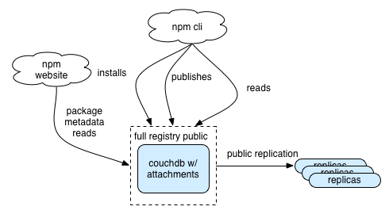
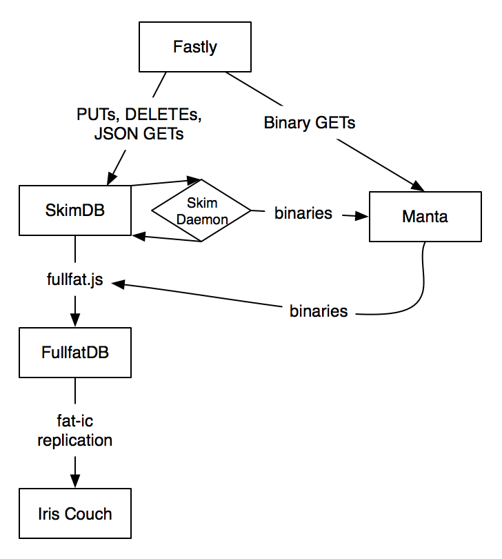

# [fit] stabilizing the
# [fit] registry

---

# [fit] C J Silverio
## [fit] director of engineering
## [fit] @ceejbot

---

# [fit] This is the story of a
# [fit] plucky package registry
# [fit] named npm

----

# [fit] scaling problem
# [fit] appearing as a
# [fit] stability problem

---

# [fit] "scaling"
# [fit] capacity to meet
# [fit] growing demands

^ Definitions. Whatever form those demands take

---

# [fit] "At scale"
# [fit] huge demand & lots of data

^ Google, Facebook, Apple, Twitter-- those are "at scale". Peeps in audience from Netflix & Paypal have a bigger scaling challenge. Npm: not at scale. But when hundreds of cos start using it, it acquires a scaling problem.

---

# [fit] "stability"
# [fit] not falling over
# [fit] under normal demand

^ For bonus points, not falling over under peak demand.

---

# [fit] 129,796 packages
# [fit] 239 GB package tarballs
# [fit] 40 million package dls/day
# [fit] 1500 req/sec, peak 3200

^ If I gave you those requirements as a greenfield project, you wouldn't have much trouble building a system. The problem is that you never have a greenfield proj. You have legacy projects.

---

# [fit] "Legacy"
# [fit] Anything you've put
# [fit] into production

^ Legacy is inertia. It's mass that slows down change. Code in production can't be changed without understanding how the existing system works.

---

# [fit] this is the story of
# [fit] a legacy system
# [fit] becoming more flexible

^ The plucky little npm.

---

^ Here's our protagonist's starting point. This is the starting architecture. The registry lives entirely inside a single CouchDB instance. Tarballs are base64-encoded attachments on package documents. The app logic is entirely implemented as javascript inside Couchdb. NO NODE

---

# [fit]  January 2013
# [fit] 20K packages
# [fit] .5 million dls/day

^ There is no load to speak of. Practically anything could handle this. Our little npm strolls through the day.

---

# October 2013

^ Then something happened: you all started adopting node.

---

# [fit] Oct 2013
# [fit] 44K packages
# [fit] 108 million dls/month
# [fit] 3.6 million dls/day

^ Then you all started adopting node, and what had worked for 2 years stopped working. Twice the number of packages, 7 times the usage. These numbers are not large, but it's a tipping point.

---

# [fit] our plucky little registry
# [fit] had to change

---

# [fit] step 1: CDN
# [fit] Put Fastly.com
# [fit] in front of the registry

^ Obvious? Yes! This put out the worst of the fires. The problem is that it costs $ to do this, and side projects run on donated hosting don't have $.

---

# [fit] cache rules
# [fit] everything
# [fit] around me

^ Put it behind a CDN. Data not changing? CACHE IT. (Changed the npm application so more of the data is immutable, e.g., you can't change a version once you've published it. We can cache even more!) CDN benefits.

---

# [fit] step 2: tarballs
# [fit] get them out of couchdb

^ Application changes begin.

---

# [fit] tarballs are huge!
# [fit] couch runs faster without them
# [fit] base64 decoding is work.

^ Binary blobs don't belong in dbs that need to base64 encode them.

----

^ January 2014. This was more or less holding up under the load, though there were still outages with absolutely no visibility into why.

---

# [fit]  January 2014
# [fit] 60K packages
# [fit] 6+ million dls/day

^ 3x the packages, 16x the dls. Act 2 begins.

---

# [fit] step 3: visibility
# [fit] are things going wrong?
# [fit] what's going wrong?

^ Nagios is a horror but it's state of the art, apparently, and it is solid enough to monitor your other monitoring systems. NOT TWITTER

---

# [fit] Monitoring
# [fit] & alerts

^  is a host up/down is a boring question. you need to monitor your user's experience. is the service working from their POV? if not, what are the telltales?

---

## [fit] reactive monitoring
## [fit] monitor deeply
## [fit] fix things quickly

^ Stabilization stage 1: react quickly. Notice when we're down & fix by hand.

---

## [fit] proactive monitoring
## [fit] self-healing
## [fit] \(also things don't break)

^ Monitor checks also fix problems where possible. Deeper problems fixed with engineering. Unit tests for your deployment.

---

## [fit] monitoring is unit testing
## [fit] Add monitoring after
## [fit] every outage

^ What would have tipped you off that things were about to break?

---

# [fit] visibility is a prerequisite
# [fit] but not a solution

^ We're still not actually scaling. CouchDB is still falling over. But we have the information we need: we know what's hot, what's okay, what's unstable.

---

# [fit] act on what monitoring
# [fit] and metrics reveal

---

# [fit] step 4: redundancy
# [fit] several couchdbs for reads
# [fit] 1 for writes, 1 for public replication

^ Separate writes from reads. Separate out replication.

---

# [fit] fewer responsibilities
# [fit] for each piece
# [fit] isolates errors

^ In this case, we were able to discover that what we had thought was a load problem with couchdb was actually a *bug* in password generation at the Erlang layer.

---

# [fit] step 5: automation
# [fit] ansible
# [fit] no server is special

^ Chef, Puppet, Salt, Ansible: USE SOMETHING. No special snowflakes. All hosts are configurable remotely & can be replaced easily. Discipline. We do periodic exercises where we replace a server.

---

# [fit] June 2014
# [fit] Superficially
# [fit] similar.

^ Pretty reliable. We know when our providers are down before they do sometimes. Writes are separated from reads. Scaled by throwing hardware & $ at the problem. One really big invisible change here.

---

# [fit]  June 2014
# [fit] 80K packages
# [fit] 10 million dls/day

^ We're handling this load easily.

---

# [fit] the midpoint twist:
# [fit] now 100% on AWS/Ubuntu
# [fit] 70/30 west/east split

^ As we automated configuration for each of these components, we moved it to AWS.

---

# [fit] step 6: simplification
# [fit] now that it's boring
# [fit] we can modify at leisure

^ We understand the system fully. We have control of all of the pieces of the registry. We have visibility. So we can simplify.

---

^ The registry last fall. Massively over capacity. Extra capacity for redundancy: if an AWS region goes down, we're fine. Known single points of failure.

---

# [fit]  Nov 2014
# [fit] 105K packages
# [fit] 28 million dls/day peak

^ We're handling this load easily with fewer servers, more cheaply. Bandwidth remains our major cost.

---

# [fit] 50/50 AWS region split
# [fit] no AWS-specific magic
# [fit] Ubuntu 14.04 Trusty

^ We use as few AWS features as possible to keep our options open.

---

# [fit] Fastly: geoloc + varnish
# [fit] haproxy + CouchDB
# [fit] nginx + a filesystem

^ Simple pieces with good visibility. The tarballs are now served the way they should be: from a filesystem by a simple webserver.

---

# [fit] where's the node?

^ Node's secret shame: its package registry doesn't use much node. Yet.

---

# [fit] registry 2
# [fit] electric boogaloo
# [fit] with 500% more node

^ The registry I run on my laptop looks nothing like that diagram & hasn't for a while. Now that operations are boring, we can do the development. Moving application logic out of couchdb & into individual node processes. Moving the data into relational databases for flexible querying.

---

^ Ah, there's the node.

---

# [fit] haproxy ➜ node services
# [fit] couchdb ➜ postgres
# [fit] redis for caching
# [fit] nginx + filesystem

^ The future stack. Might change, but correct in essentials.

---

# [fit] more complicated
# [fit] more flexible & redundant
# [fit] more scaling dials to turn

---

# [fit] excited about postgres
# [fit] ad-hoc queries are fun

^ There's a whole lot of fun data in the registry that we haven't had easy access to. In particular, live data about dependencies is going to be fun to make available to you on the website.

---

# [fit] scaling node
# [fit] is exactly like scaling
# [fit] everything else

^ recap!

---

# [fit] Understand system
# [fit] get visibility
# [fit] cool down hot spots
# [fit] add redundancy

^ Flexibility.

----

# [fit] npm client <3
# [fit] `npm install -g npm@latest`

^ So many bug fixes & performance improvements.

---

# [fit] npm loves you

^ thanks.
